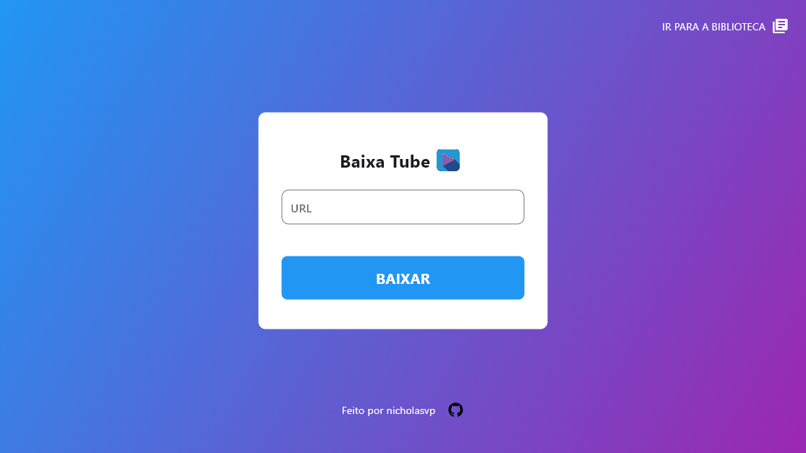
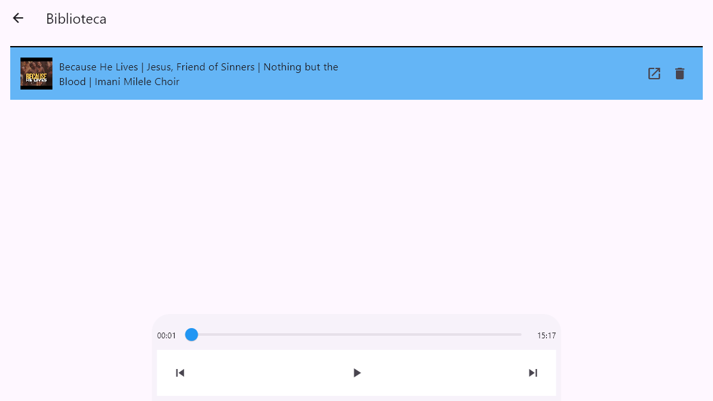
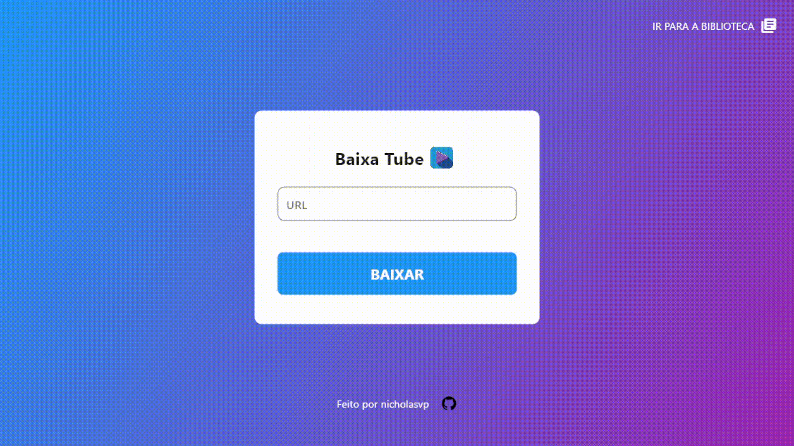

# Baixa Tube

**Baixa Tube** is a simple and fast **Windows application** that lets you **download audio from YouTube videos** using just the video link. The audio is saved directly to your PC, so you can easily transfer it to a USB drive, external hard drive, or even share it on social media.

---

## 📥 How to Download

1. Click the link below to download the compressed folder:

   👉 [Download Baixa Tube (Google Drive)](https://drive.google.com/drive/folders/1wPfFa2cRP8OHZobSx-YQYlr7HC7XVwQf?usp=sharing)

2. Extract the `.zip` file to any folder on your computer.
3. Open the folder and run `BaixaTube.exe`.

> ✅ Requirements: Windows 10 or newer  
> 📁 No installation needed — just extract and run!

---

## 🖼️ Screenshots

### Home Screen

### Library

---

## 🎞️ Baixa Tube in Action

---

## ✨ Features

- 🔗 Paste any YouTube link and download the audio with one click
- 💾 Audio is saved directly to your computer
- 🔊 High-quality `.mp3` files
- 📤 Easily transfer or share your downloads

---

## 🚧 Coming Soon

- Playlist support
- File format selection
- Download history

---

## 🛠️ Developed by

**Nicholas** – [Github](https://github.com/Nicholasvp)

---

## 📬 Contact

Have feedback or found a bug?  
Feel free to open an [issue](#) or contact me at: `nicholasvpinheiro@gmail.com`
